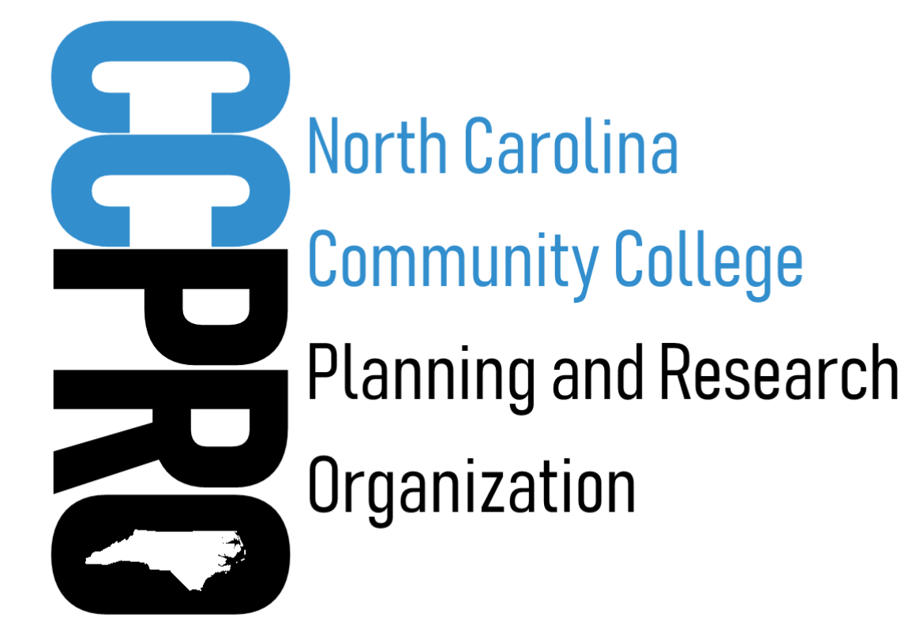

{fig-align="center" width="400px"}

## Welcome

Welcome to the Community College Planning and Research Organization (CCPRO). We are a professional organization dedicated to supporting institutional research, institutional effectiveness, and assessment professionals across North Carolina's community college system.

## Who We Are

CCPRO is composed of institutional research and institutional effectiveness professionals serving North Carolina's 58 community colleges. Our members work across a broad range of areas including data reporting, strategic planning, accreditation support, student outcomes assessment, and institutional improvement.

## What We Do

- **Professional Development:** We provide workshops, training sessions, and conference presentations to help members grow their skills and stay current with best practices.
- **Networking:** We connect IR/IE professionals across the state to share knowledge, strategies, and solutions.
- **Resource Sharing:** We curate and distribute tools, templates, and guidance relevant to community college research and assessment.
- **Advocacy:** We advocate for the role of institutional research in data-informed decision making at community colleges.

## Get Involved

Interested in joining CCPRO or learning more? Visit our [Officers](pages/executive-committee.qmd) page for contact information or check out upcoming [Conferences & Meetings](pages/conferences.qmd).

## Frequently Asked Questions
::: {.callout-note collapse="true" title="Where are the Bylaws?"}
CCPRO has a standard set of bylaws to help govern the group. You can review the [CCPRO Bylaws](documents/CCPRO-Bylaws-Revised-April-2025.pdf) at your convenience. You can also find the bylaws and other documents on the [Documents](pages/documents.qmd) page.
:::

::: {.callout-note collapse="true" title="What is our Mission Statement?"}
The Community College Planning and Research Organization (CCPRO) is a dynamic support network advancing institutional effectiveness through collaboration, communication, and visionary leadership for the North Carolina Community College System.
:::

::: {.callout-note collapse="true" title="What is our History?"}
CCPRO has a rich history of service with many talented and dedicated individuals. A quick account of the early days was narrated by Keith Brown in 2010. A full account of the document is listed here for your review: [CCPRO History](documents/CCPRO_History_2010R.pdf) as narrated by Keith Brown.
:::

::: {.callout-note collapse="true" title="Who can join CCPRO?"}
This completely free membership is provided to any current NC Community College or NC Community College System employee who is responsible for planning, assessment, accreditation, data analysis, and/or institutional research.
:::

<!-- The following section is commented out for now, but can be added back in when needed. -->
<!--
::: {.callout-note collapse="true" title="CCPRO Committees"}
Data Governance Committee
IROC IT Governance Committee
CIOA Committee
Dashboard Review Team
:::
-->

::: {.callout-note collapse="true" title="Where to find the Membership form and Directory?"}
To request membership in CCPRO, revise current membership directory information, or to view the current membership directory, please visit the [Membership Directory](pages/membership-directory.qmd).
:::
