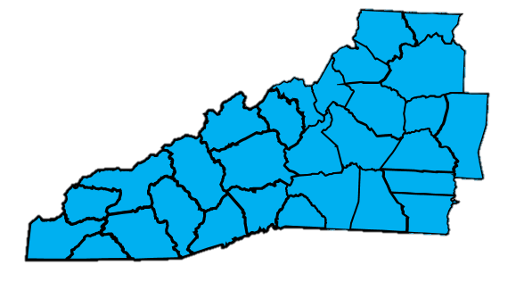
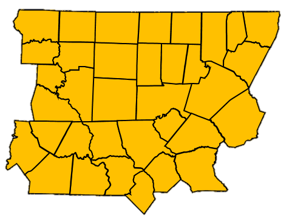
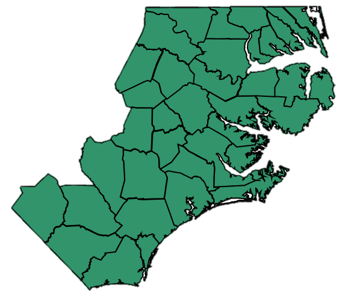

:::{style="text-align: center;"}
## Our Regions
Our three regions create collaborative communities to help bring your ideas to life. Each region has a representative on the Executive Committee as listed below along with the colleges in each region:
:::

:::: {.columns}

::: {.column width="33.33%"}
Western Region

Western Region Director: [Dr. Katie Bowman Woods](mailto:bowmankd@surry.edu) 

{fig-align="center" width="100%"}

- Asheville-Buncombe Tech Community College
- Blue Ridge Community College
- Caldwell Community College & Tech. Inst.
- Catawba Valley Community College
- Cleveland Community College
- Davidson-Davie Community College
- Gaston Community College
- Haywood Community College
- Isothermal Community College
- Mayland Community College
- McDowell Technical Community College
- Mitchell Community College
- Rowan-Cabarrus Community College
- Southwestern Community College
- Surry Community College
- Tri-County Community College
- Western Piedmont Community College
- Wilkes Community College
:::

::: {.column width="33.33%"}
Central Region

Central Region Director: [Dr. Britney L Shawley](mailto:blshawley@johnstoncc.edu)

{fig-align="center" width="100%"}

- Alamance Community College
- Bladen Community College
- Central Carolina Community College
- Central Piedmont Community College
- Durham Technical Community College
- Fayetteville Technical Community College
- Forsyth Technical Community College
- Guilford Technical Community College
- Johnston Community College
- Mountgomery Community College
- Piedmont Community College
- Randolph Community College
- Richmond Community College
- Robeson Community College
- Rockingham Community College
- Sandhills Community College
- South Piedmont Community College
- Stanly Community College
- Vance-Granville Community College
- Wake Technical Community College
:::

::: {.column width="33.34%"}
Eastern Region

Eastern Region Director: [Dr. Kimberly Mullis](mailto:kimberly.mullis@beaufortccc.edu)

{fig-align="center" width="100%"}

- Beaufort County Community College
- Brunswick Community College
- Cape Fear Community College
- Carteret Community College
- College of the Albemarle
- College of the Albemarle
- Craven Community College
- Edgecombe Community College
- Halifax Community College
- James Sprunt Community College
- Lenoir Community College
- Martin Community College
- Nash Community College
- Pamlico Community College
- Pitt Community College
- Roanoke-Chowan Community College
- Sampson Community College
- Southeastern Community College
- Wayne Community College
- Wilson Community College
:::

::::